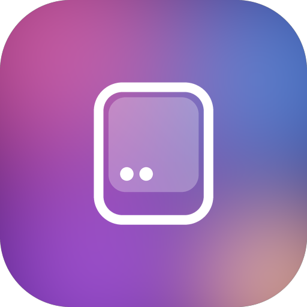
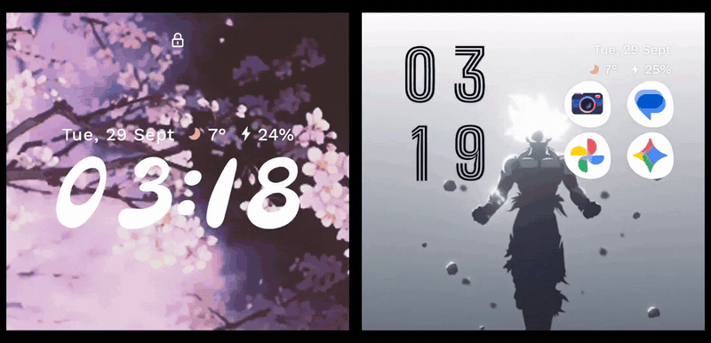
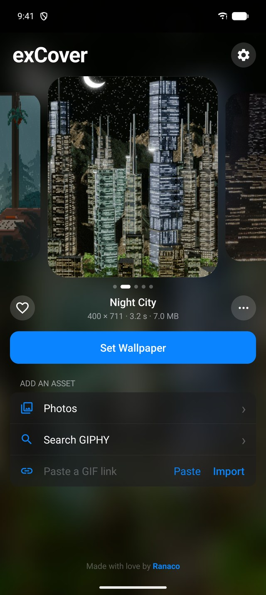
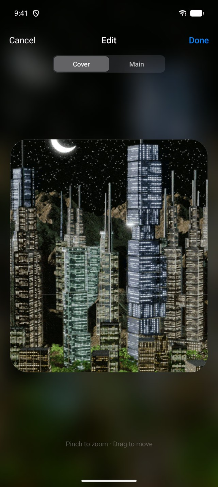
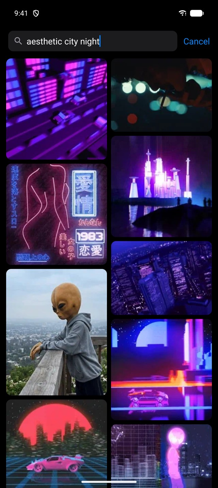
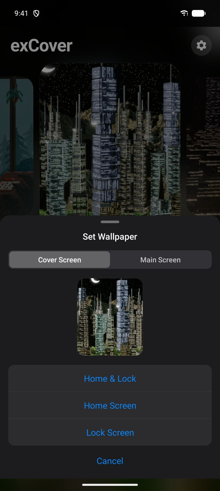
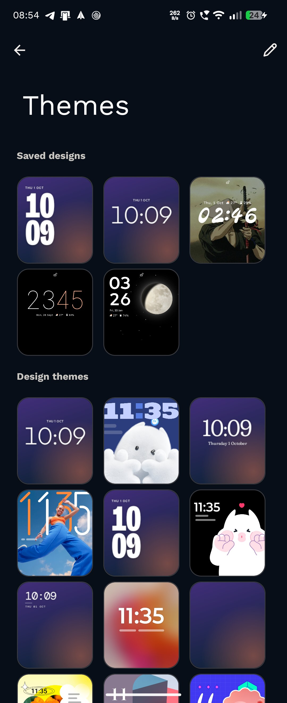
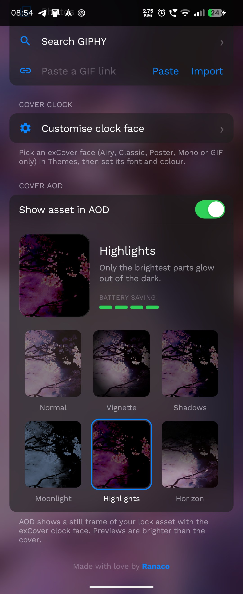

<div align="center">



# exCover

**Animated GIFs, clock themes and a GIF always-on display for your Motorola Razr's cover screen.**

The Razr has a great outside screen, and Motorola only lets you put a photo on it.
exCover puts animated GIFs there instead, from your gallery, GIPHY or any link, on the cover
home screen, the cover lock screen and the main screen. It also adds its own clock themes to
Motorola's cover theme picker, and keeps your GIF on the cover always-on display.




<sub>Cover lock screen and home screen on a Razr 50 Ultra. GIFs from GIPHY: "anime aesthetics" by animatr and "Game Illustration".</sub>









<sub>exCover's themes next to Motorola's in the cover Themes picker, and the AOD looks in exCover.</sub>

</div>

> [!NOTE]
> **Samsung Flip owners:** your phone already does this out of the box. Congratulations, please
> stop gloating. If you still want exCover on a Flip, I'll port it the moment I get my hands on
> one. Donated Galaxy Z Flips are accepted gratefully, for purely scientific purposes.

## Features

**On the cover screen**

- GIFs stay animated on the cover home and lock screens, not a still frame.
- **Clock themes in Motorola's own picker.** exCover adds five themes to the cover lock screen's
  Themes, right next to Motorola's: Airy, Classic, Poster, Mono and GIF only. Each has its own
  font, and they customise like Motorola's themes do, with the font (123) and colour buttons.
- **Your GIF on the always-on display.** When the cover goes to sleep, the clock fades out and
  the GIF eases into a dimmed still frame.
- **Six AOD looks** to choose from, most of them built to save battery. See [Cover AOD](#cover-aod).

**In the app**

- Find GIFs in Photos, search GIPHY inside the app, or paste any GIF link.
- Frame them in a full-screen editor with pinch and drag. The cover screen and the taller main
  screen each get their own framing.
- Set cover home, cover lock, main home and main lock separately, each with its own GIF.
- Swipe between your last five GIFs. Favourites stay in the list for good.
- Save a GIF to Photos or delete it from the list. Once imported, everything works offline.

**Under the hood**

- No root, no ADB, no account, no tracking.
- Frames are decoded off the main thread and drawn on the GPU, and the wallpaper pauses while the
  screen is off.

## Install

1. Download the latest `exCover.apk` from **[Releases](../../releases)**.
2. Open it on your phone and allow installing from your browser or file manager when asked.
3. Open **exCover**.

Tested on a **Motorola Razr 50 Ultra** (Android 17). Other recent Razrs with the same cover-screen
software should work. If yours does or doesn't, [open an issue](../../issues) so the list can grow.

| Model | Cover home | Cover lock | Clock themes and cover AOD | Inner AOD |
| --- | --- | --- | --- | --- |
| Razr 50 Ultra (Android 17) | Works | Works | Works | Motorola monochrome only |
| Razr 50 (Android 16) | Works (Digital design) | Not possible yet | Needs Android 17 | Motorola-controlled |

The cover lock screen depends on Motorola's lock screen app, which changed with Android 17. On
Android 16 it only offers photos in the lock screen's Wallpaper row, for any live wallpaper,
Motorola's own included. The Android 17 version added live wallpapers there, so the Razr 50
should get cover lock support with that update. The exCover clock themes and the GIF on the
cover AOD also need Android 17 or later.

## Set it up (one time, about a minute)

Motorola decides what its cover screen shows, so the first time you pick exCover in Motorola's
own settings. exCover opens the right screen for you.

1. In exCover, choose a GIF (**Photos**, **Search GIPHY**, or paste a link) and tap the preview to
   frame it.
2. Tap **Set Wallpaper → Cover Screen → Home & Lock**.
3. **Home screen:** if Motorola hasn't given exCover the cover yet, its wallpaper picker opens.
   Choose **exCover**.
4. **Lock screen:** in exCover, tap **Cover clock → Customise clock face**. This opens Motorola's
   cover lock screen editor (also at **Settings → External display → Lock screen**). Tap
   **Themes**, choose **exCover Airy**, **Classic**, **Poster**, **Mono** or **GIF only**, set
   its font and colour with the 123 and colour buttons, and save. These themes draw your lock GIF
   and also give the cover AOD your GIF.
5. **AOD look:** back in exCover, pick a look under **Cover AOD**.

After that, pick a GIF in exCover and tap **Set Wallpaper**. The cover screen updates straight
away.

Prefer one of Motorola's own themes? Pick one that has a **Wallpaper** row and choose the
**exCover** card there instead. You get the animated GIF on the lock screen, but Motorola's
themes keep Motorola's own AOD, and themes with built-in artwork (the moon one, for example)
cover up any wallpaper.

**Main screen:** **Set Wallpaper → Main Screen** opens Android's wallpaper preview. Tap **Set**
and choose home, lock, or both.

## Cover AOD

With an exCover theme, the cover's always-on display shows a still frame of your lock GIF. The
cover is an OLED panel, where a black pixel is simply off, so instead of laying a flat dark layer
over the GIF, exCover offers six looks:

| Look | What it does |
| --- | --- |
| Normal | Your GIF, evenly dimmed. Nothing else changes. |
| Vignette | A softly lit centre, with the edges fading into black. |
| Shadows | Full colour where it's lit, true black everywhere else. |
| Moonlight | A cool silver-blue night version of your GIF. |
| Highlights | Only the brightest parts glow out of the dark. Uses the least battery. |
| Horizon | Your GIF rises out of black from the bottom. |

The app previews each look on your own GIF, with a battery-saving meter. On the GIF I tested,
Highlights gives off about a fifth of the light of a plain dim, and Vignette a little under half.
Turn off **Show asset in AOD** for a fully black AOD.

A few things worth knowing:

- **It's a still frame.** About two seconds into AOD, Android suspends the cover panel and it
  holds its last frame until the next wake-up. Only Motorola's system apps can keep it updating,
  so exCover pauses the GIF once AOD settles instead of drawing frames nobody sees.
- **Burn-in protection** works as with Motorola's own themes: the frame shifts slightly now and
  then.
- **Battery Saver turns the cover AOD off** completely. That's Motorola's behaviour, and it
  happens with Motorola's themes too.
- **It needs Android 17** or later.

### About the inner always-on display

The inner lock screen can use an exCover GIF when it wakes, but the inner *always-on display*
cannot. On the Razr 50 Ultra's Android 17 firmware, Motorola routes inner AOD through a
signature-protected system renderer and forces even Motorola's colorful lock styles to a
monochrome outline while the panel is truly dozing. A normal, non-root app cannot replace that
renderer. exCover does not fake AOD by keeping the main screen awake.

## Troubleshooting

| What you see | What to do |
| --- | --- |
| Cover lock screen shows a theme's own art, not your GIF | Choose an exCover theme in **Themes**, or a Motorola theme with a **Wallpaper** row and the exCover card. |
| No exCover themes in **Themes** | Your phone needs Android 17. If you're on Android 17 and they vanished after a restart, update to exCover 1.1.0 or later and choose one again. |
| exCover isn't in the lock screen's Wallpaper row, only photos | Your phone is on Android 16, where Motorola doesn't allow live wallpapers there. The cover home screen still works. |
| exCover isn't in the home screen's Wallpaper row | Update exCover. On Android 16, Motorola only lists it in the Digital design (the default) or in designs without their own wallpaper set. Tap **Themes** and switch design if you use another one. |
| Cover AOD is black with an exCover theme | Turn on **Show asset in AOD** in exCover. |
| Cover AOD turns completely off | Turn off **Battery Saver**. Motorola powers the cover panel off while it's on, even when Always-on display is enabled. |
| Cover screen went black after an update | Android occasionally drops the lock screen after an app update. Tap **Set Wallpaper** again. exCover notices and walks you back through Motorola's editor. |
| Cover screen is black after uninstalling | Motorola keeps pointing at the removed app. Pick a normal wallpaper and theme in **Settings → External display**. Doing that *before* uninstalling avoids it. |
| Inner AOD is still black and white | This is a Motorola firmware restriction, not a missing exCover setting. exCover's AOD is for the cover display. |
| GIPHY search says a key is needed | You built the app yourself. See [Building](#building). |

## Building

Requirements: Java 17, Android SDK 37.

```powershell
.\gradlew.bat assembleDebug
adb install -r .\app\build\outputs\apk\debug\app-debug.apk
```

GIPHY search needs your own free API key from [developers.giphy.com](https://developers.giphy.com/)
(choose **API**, not SDK). Add it to `local.properties`, which is never committed:

```properties
giphy.apiKey=YOUR_KEY
```

Without a key, everything except GIPHY search still works.

## How it works

The Razr's cover screen is run by Motorola's own apps, with a few undocumented hooks that exCover
uses the same way Motorola's content does.

**Wallpapers**

- The cover has its own wallpaper slots, separate from the main screen's. exCover's wallpaper
  service declares Motorola's `moto.cli.livewallpaper` metadata, so Motorola's cover wallpaper
  pickers list it next to their own.
- One service instance runs on each screen (cover home, cover lock, main home, main lock) and
  draws the GIF chosen for that slot, with that slot's framing. GIFs are decoded with
  `ImageDecoder` / `AnimatedImageDrawable`, so frames decode on a background thread and are drawn
  by the GPU.

**Clock themes and AOD**

- The cover lock screen is drawn by Motorola's clock face app, which also accepts themes from
  other apps. A content provider lists exCover's five themes to it, so they appear in Themes
  next to Motorola's.
- Each theme declares a font setting and Motorola's colour setting, so Motorola's own editor
  shows the 123 and colour buttons and sends the choices back to exCover.
- A session service draws the theme into a surface that Motorola embeds on the cover. Motorola
  uses the same theme for the lock screen and its AOD, so one surface draws the awake clock, the
  transition, and the AOD frame, toned with a colour curve and moved with Motorola's burn-in
  offsets.
- Motorola's clock face app starts before the phone is first unlocked, so exCover's themes are
  available from boot and load your GIF and settings as soon as you unlock.

<details>
<summary>Advanced: set the cover slots over ADB</summary>

`tools/SetCoverWallpaper.java` runs as Android's shell user and can bind, back up, or restore the
cover home and lock slots directly. You shouldn't need it, but it's handy for testing.

```powershell
.\tools\build-helper.ps1
adb push .\tools\set-cover.jar /data/local/tmp/set-cover.jar
adb shell "CLASSPATH=/data/local/tmp/set-cover.jar app_process /system/bin SetCoverWallpaper set home com.ranaco.razrcoverwallpaper com.ranaco.razrcoverwallpaper.GifWallpaperService"
```

</details>

## Privacy

- GIFs you import are copied into the app's private storage and never leave your phone.
- The only network requests are the ones you start: GIPHY searches and GIF downloads.
- No analytics, no ads, no account.
- Photos are opened through Android's picker, which grants access to the one file you choose.

## Fonts

The clock themes use Outfit, Fraunces, Bricolage Grotesque and Space Mono, all under the SIL Open
Font License 1.1. Their licence texts are in [`third_party/fonts`](third_party/fonts).

## Contributing

Issues and pull requests are welcome, especially reports from other Razr models.

---

<div align="center">

Made with love by [Ranaco](https://github.com/Ranaco)

</div>
